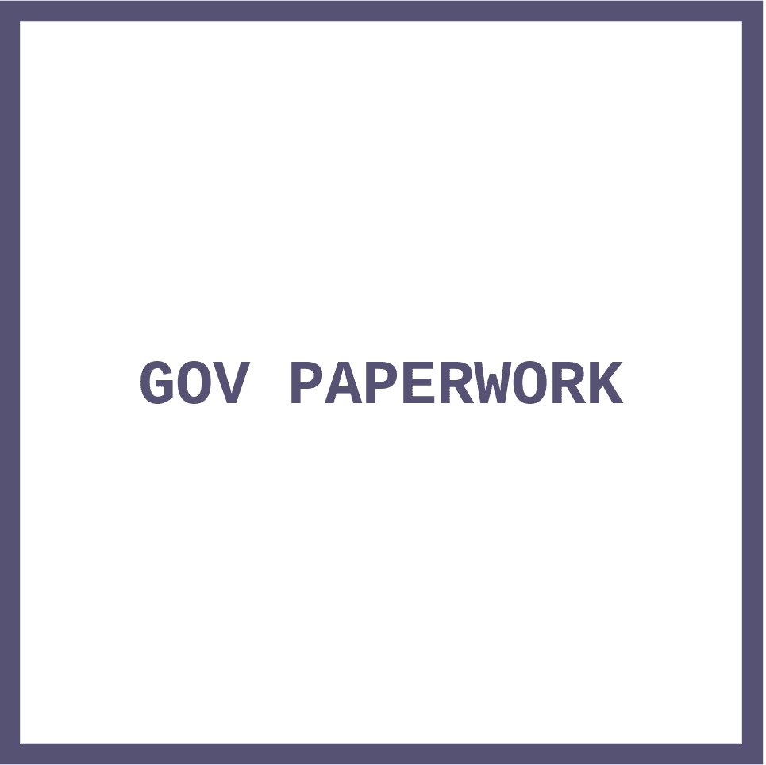
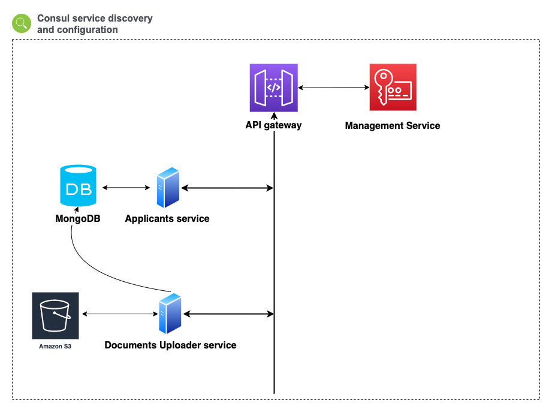

<h1 align="center">
	 
	
	 
	 
</h1>

> Spring Boot + Cloud powered project

## Overview

GOV paperwork is a project to show how can be used Spring Cloud tools and more for building distributed systems.

### Architecture

> Note: Documents uploader is not finished

<h1 align="center">
	 
	
	 
	 
</h1>

#### Components

[API GATEWAY](https://github.com/ordfanger/gov-paperwork-api-gateway) - built using Spring Cloud Gateway.

[MANAGEMENT SERVICE](https://github.com/ordfanger/gov-paperwork-management) - oauth2 resource server. Users, jwt tokens, api keys managed using OKTA.

[APPLICANTS SERVICE](https://github.com/ordfanger/gov-papework-applicants) - API for getting users. 

[CONFIGURATION](https://github.com/ordfanger/gov-paperwork-configuration) - implemented using CONSUL k/v storage.

Service discovery and load-balancing based on CONSUL and Spring Cloud Loadbalancer.

## How to run locally

For running this project locally you need to install [CONSUL](https://www.consul.io/docs/install),
[MONGODB](https://docs.mongodb.com/manual/installation/)

The easiest way is to use docker

`docker run -p 8500:8500 consul`

`docker run -p 27017-27019:27017-27019 mongo`

Next step is applying [configuration](https://github.com/ordfanger/gov-paperwork-configuration). 

When configuration is successfully added to consul k/v storage, we need to start [API GATEWAY](https://github.com/ordfanger/gov-paperwork-api-gateway) using maven wrapper `./mvnw spring-boot:run`. All project services use maven.

For verifying JWT tokens we need to run [MANAGEMENT SERVICE](https://github.com/ordfanger/gov-paperwork-management).

Last step is to run all remaining services.

API gateway by default uses port 9090. All remaining services is hidden behing api gateway.

API documentation for management, applicants service is hosted on `{host}/{service}/api-docs`

`http://localhost:9090/applicants/api-docs`
`http://localhost:9090/management/api-docs`

## Todos
- [ ] Documents uploader service
- [ ] Test coverage
- [ ] Deployment setup

## License

This project is licensed under the MIT License.